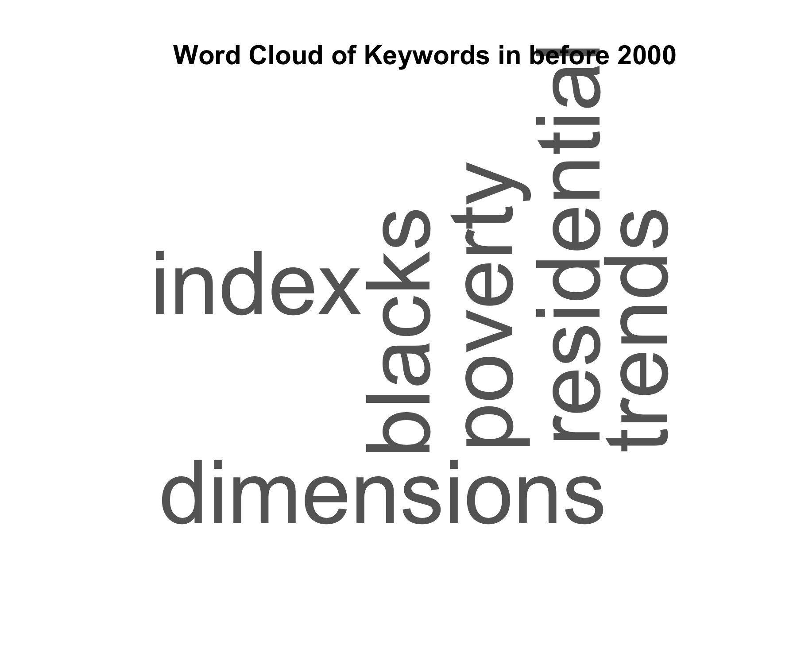
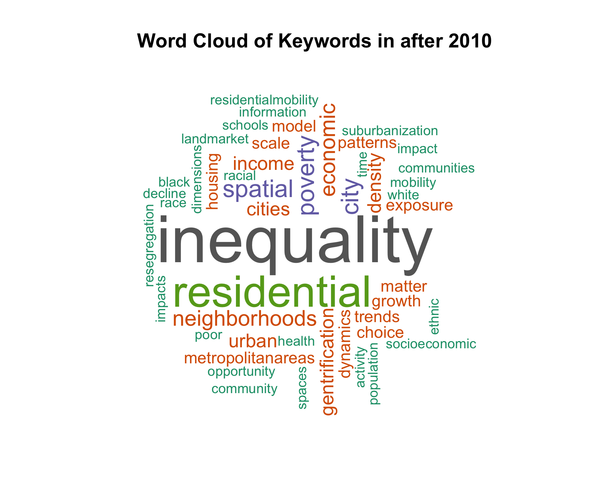

A guide and toolbox for conducting systematic literature reviews in urbanism

This repository is used to collaboratively exemplify our guidelines on how to conduct SLRs with R in Urbanism.

- “rqmd” – this is where your R markdown files are stored
- “r” – this is where additional R script files are stored
- “output” – this is where you will store fake data generated in this class
- “images” – this is where image files are stored

Example data:

Github does not handle well with dataset that is larger than 100mb.

The example data has been uploaded to Open Science Framework. And [current link](https://osf.io/emxqy/?view_only=70fab91afab747d685eca7ed5b8d88f8) is for view and download only. 

| The analysis Framework                                       |
| ------------------------------------------------------------ |
|  |

| Geographical Mapping                         | Tiled Mapping                                |
| -------------------------------------------- | -------------------------------------------- |
|  |  |

| Overall                                                | Before 2000                                                |
| ------------------------------------------------------ | ---------------------------------------------------------- |
|          |  |
| **2000-2010**                                          | **After 2010**                                             |
|  |    |

