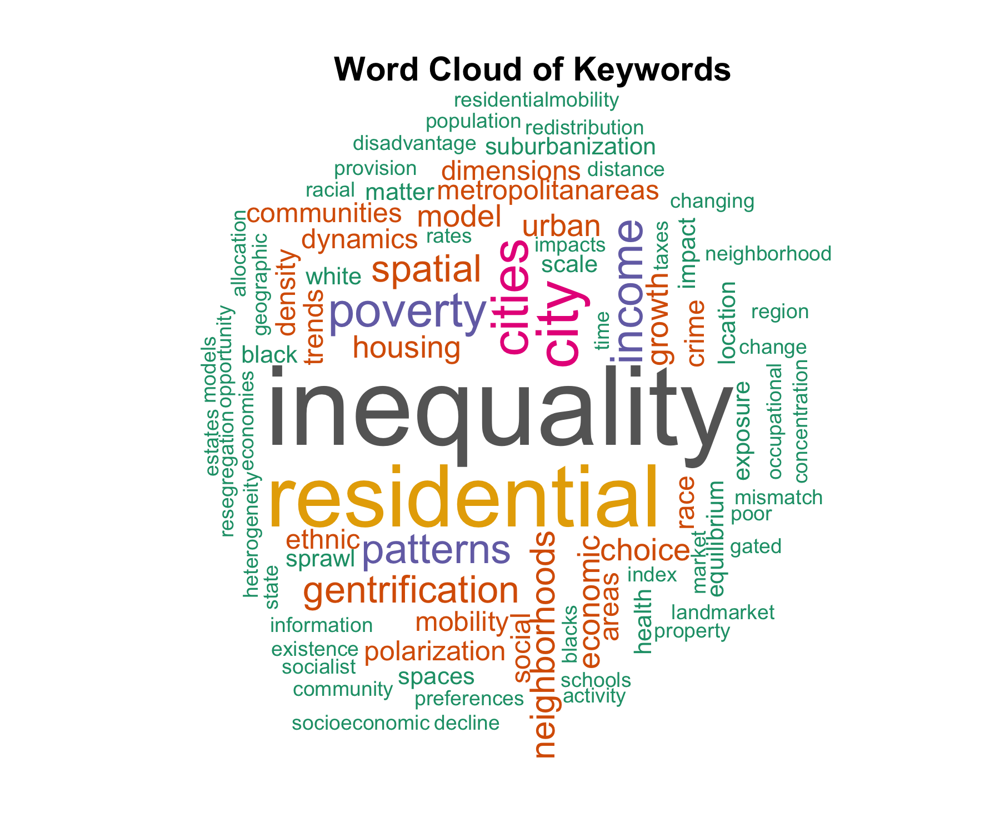

A guide and toolbox for conducting systematic literature reviews in urbanism

This repository is used to collaboratively exemplify our guidelines on how to conduct SLRs with R in Urbanism.

- “rqmd” – this is where your R markdown files are stored
- “r” – this is where additional R script files are stored
- “output” – this is where you will store fake data generated in this class
- “images” – this is where image files are stored

## Preparation

### API keys

Create a new file named **personal_scopus_api_key.md**, and input 

### Data

Example data:

Github does not handle well with dataset that is larger than 100mb.

The example data has been uploaded to Open Science Framework. And [current link](https://osf.io/ds83p) is for view and download only. 

| The analysis Framework                                       |
| ------------------------------------------------------------ |
|  |

## Visulisation Examples

### Meta Data

#### Papers published by the year and overlaid with highly cited papers

| Number of papers by year                                     | Overlay with High Citation Papers                            |
| ------------------------------------------------------------ | ------------------------------------------------------------ |
|  |  |

- Generated table of highly cited papers in recent 5 years

| High citation papers in recent 5 years (automatically extracted) |
| ------------------------------------------------------------ |
| Socio-economic  segregation in European cities. A comparative study of Brussels, Copenhagen,  Amsterdam, Oslo and Stockholm |
| Proximate sources of growth in  neighborhood income segregation: Class-selective migration versus in sita  change |
| Income segregation's impact on local  public expenditures: Evidence from municipalities and school districts,  1980-2010 |
| Income Segregation between School  Districts and Inequality in Students' Achievement |
| Discovering income-economic segregation  patterns: A residential-mobility embedding approach |
| Civic Life in the Divided Metropolis:  Social Capital, Collective Action, and Residential Income Segregation |
| Exploring the global and local patterns  of income segregation in Toronto, Canada: A multilevel multigroup modeling  approach |
| On the link between rail transit and  spatial income segregation |
| Building Inequality: Housing Segregation  and Income Segregation |
| Technology, talent and economic  segregation in cities       |

#### Interest of keywords overtime

| Overall                                                | Before 2000                                                |
| ------------------------------------------------------ | ---------------------------------------------------------- |
|          |  |
| **2000-2010**                                          | **After 2010**                                             |
|  |    |

### Full Text Mining

#### Geospatial location

| Geographical Mapping                         | Tiled Mapping                                |
| -------------------------------------------- | -------------------------------------------- |
|  |  |

#### Co-occurance of word of interests

| Bar chat of top words related to the term "income"        | Word cloud of top words related to the term "income"      |
| --------------------------------------------------------- | --------------------------------------------------------- |
|  |  |
|       |                                                           |

